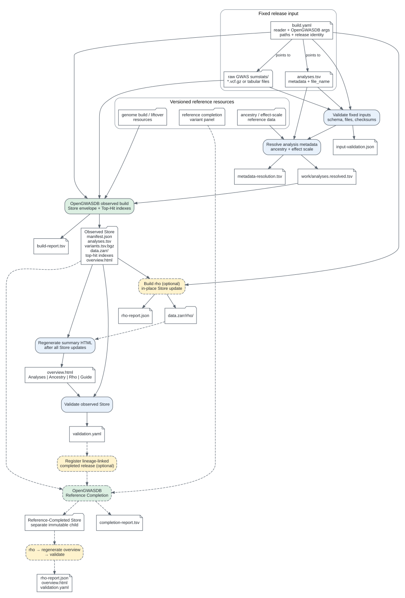

# Store Release workflow

Status: proposed architecture for issue #86 (2026-09-11).

This specification defines the fixed input and file/process DAG for building an
OpenGWASDB Store Release. It deliberately excludes a Preflight Run and human
approval gate. Those may be added later as an optional target without changing
the core build boundary.

The authoritative diagram is
[`docs/diagrams/store-release-workflow.svg`](../diagrams/store-release-workflow.svg),
generated from the adjacent
[`store-release-workflow.dot`](../diagrams/store-release-workflow.dot).



## Fixed-input boundary

The shared pipeline begins with exactly three Store Release inputs:

1. a directory containing acquired raw GWAS summary-statistics files;
2. an `analyses.tsv` containing the exact selected Analyses and the file name
   for each one;
3. a `build.yaml` that points to the directory and TSV and declares how the
   sources are read and how OpenGWASDB is invoked.

Together these form the fixed input to the Store build. Store-specific helpers
may produce them, but the shared pipeline does not discover Analyses by scanning
the raw directory or by embedding Store-specific selection logic.

A Source Inventory and `analyses.tsv` are related but distinct. A Source
Inventory may describe every acquired upstream file. A Store-specific helper
can select from it and emit `analyses.tsv`; the shared build consumes only that
exact release selection.

## `build.yaml` responsibilities

The configuration must carry enough information to execute the build without a
hardcoded Store-specific script:

```yaml
release:
  store_family_id: ukb-b
  family_release_id: dense-observed-v1

source:
  root: /data/opengwasdb/raw/ukb-b
  analyses: analyses.tsv
  reader:
    capability: opengwasdb.gwas-vcf
    options: {}

build:
  command: build-dense-vcf        # an opengwasdb CLI subcommand
  arguments:                      # opaque; passed through unchanged as CLI flags
    store-id: ukb-b
    release-id: dense-observed-v1
    n-workers: 16

references:
  liftover_chain: reference-resources/grch37-to-grch38.yaml
  ancestry_alignment: reference-resources/ukb-eur-af.yaml

rho:
  enabled: true

reference_completion:
  enabled: true
  family_release_id: dense-reference-completed-v1
  command: complete-dense
```

`build.command` names an `opengwasdb` CLI subcommand, not an importable Python
entrypoint: the operation is the shipped CLI (`opengwasdb --help`), so the
configuration is executable on its own and no Store-Family-specific adapter has
to import and call it. `build.arguments` is an **opaque** flag mapping passed
through to that subcommand unchanged; it is deliberately not a semantic schema,
so a newly required builder flag (for example `build-dense-vcf`'s `store-id`,
`release-id`, and EAF-orientation gate) is absorbed without a configuration
change. `reference_completion.command` names the CLI subcommand for the child
Reference-Completed release in the same way.

`source.root` and `source.analyses` are resolved relative to the release
directory unless absolute, so `analyses.tsv` normally sits beside `build.yaml`
while `source.root` points at external acquired inputs. The schema evolves the
pre-existing `build.yaml` in place - one filename, one schema - rather than
introducing a second file; the decision and the legacy-compatibility rule are
recorded in ADR 0022, and
[`resources/lib/release_plan.py`](../../resources/lib/release_plan.py) loads and
validates a release's plan before any build step runs:

```bash
python3 resources/lib/release_plan.py families/ukb-b/releases/dense-observed-v1
```

It reports pass/fail with a reason naming the offending key, and refuses an
unknown `build.command`, rho on a non-Dense layout, an unresolved Reference
Resource, and a selected source file that is missing or checksum-mismatched.

`source.reader.options` is capability-specific. GWAS-VCF needs no column map;
a general tabular reader would declare source column names there. The concrete
reader capability and accepted options remain an OpenGWASDB contract, not logic
implemented in Snakemake.

The exact `analyses.tsv` columns are governed by the shared OpenGWASDB Analysis
schema (ADR 0017). At this workflow boundary it must at least identify each
Analysis and its source file unambiguously; paths are resolved relative to
`source.root` unless explicitly absolute.

## Core DAG

The observed-release path is:

1. Validate `build.yaml`, `analyses.tsv`, the selected source files, checksums,
   reader configuration, and referenced resources. Emit
   `input-validation.json`.
2. Resolve or verify ancestry and effect-scale metadata. Emit the immutable
   working input `work/analyses.resolved.tsv` and a resolution report.
3. Invoke the configured OpenGWASDB CLI subcommand (`build.command`) with its
   opaque `build.arguments`. It produces the Store envelope, initial
   `overview.html`, and Top-Hit indexes, plus a build report.
4. If enabled, build rho as an explicit in-place Store operation and emit its
   report.
5. Regenerate `overview.html` after every Store mutation so the final page
   includes the Rho tab as well as Analyses, Ancestry, and Guide content.
6. Validate the complete Store and emit `validation.yaml`.

Top-Hit construction is not a separate Snakemake phase for the current Dense
and Hybrid operations because OpenGWASDB constructs those indexes during the
core build and Reference Completion operations. If OpenGWASDB later exposes a
different lifecycle, the DAG should follow that public operation rather than
duplicating its implementation here.

## Reference Completion branch

Reference Completion is optional and begins only after the observed Store has
validated. It registers a distinct Store Release whose lineage names the
observed parent, then uses the configured reference panel to create a separate
Store. Rho, summary regeneration, and final validation are run for that child in
the same order as for the observed Store.

The child is never an in-place mutation of the observed release (ADR 0007).

## Ownership

- Store-specific helper scripts own acquisition, provider-specific metadata
  calls, selection policy, and production of the fixed input.
- Shared helper modules may own downloading, checksum calculation, provider API
  access, and ontology lookup when more than one Store Family uses them.
- Snakemake owns dependencies, conditional branches, resource requests, and
  resumption.
- OpenGWASDB owns source reading, normalization, Store construction, Top-Hit and
  rho operations, overview generation, and Store validation.
- This repository owns the accepted release definitions and small reports; raw
  inputs, work files, and Store artifacts remain outside Git (ADR 0015).

## Resumption contract

Snakemake must not use the modification time of a large mutable Store directory
as evidence that a phase succeeded. Each expensive or in-place operation emits
a small completion record only after its output passes the phase-specific
read-back checks. A partial Store has no successful completion record and is
therefore resumed or rebuilt on the next invocation.

Every completion record binds at least:

- the phase name and Store Release identity;
- hashes of `build.yaml`, `analyses.tsv`, selected raw files, and relevant
  reference-resource descriptors;
- the OpenGWASDB revision and effective operation arguments;
- output locations, completion time, and validation result.

Changing a bound input invalidates that phase and its downstream dependents.
The production implementation must define whether a failed phase can safely
continue within an existing partial output or must replace it atomically.

## Orchestrator interface

The intended operator surface is one command with the Store's YAML as the
Snakemake config file:

```bash
snakemake --configfile families/ukb-b/releases/dense-observed-v1/build.yaml
```

The Snakefile should contain dependency wiring only. It must not contain source
column mappings, Store Family conditionals, manifest translation, or copied
builder logic. A throwaway executable model of this design lives in
[`resources/prototypes/snakemake-release-pipeline/`](../../resources/prototypes/snakemake-release-pipeline/).
